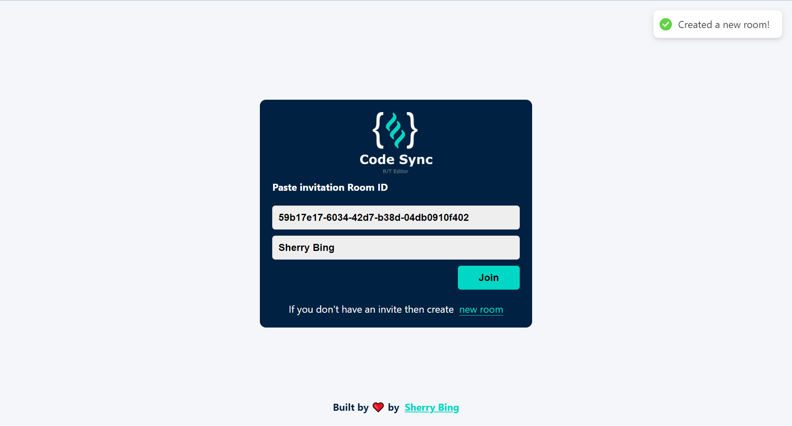

# react-websocket-real-time-code-editor

使用 Socket.io 實現多人即時共筆程式編輯器

## Demo



## 使用技術

- server
  - node.js
  - socket.io
- client
  - react
  - react-router-dom
  - socket.io-client

## 執行

請在終端機各別進入 server, client 資料夾後分開執行專案

```cmd
npm i && npm run start
```

> 後端成功啟用會顯示 Server listening on 5000

> 前端成功啟用則可開啟 http://localhost:3000